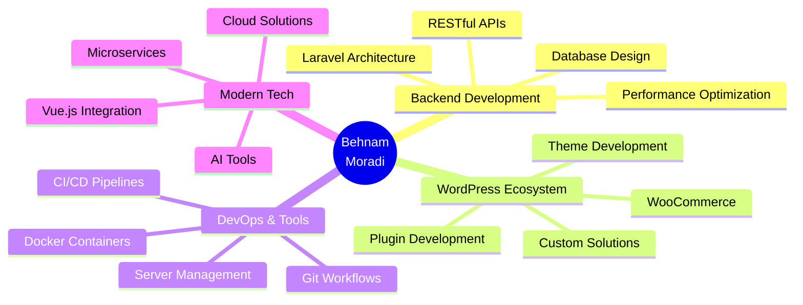

<div align="center">

<!-- Animated Header with Glassmorphism Effect -->


<!-- Typing Animation -->


<br/>

<!-- Social Badges with Glassmorphism -->
<a href="https://behnammoradi.com" target="_blank">
  
</a>
<a href="https://www.linkedin.com/in/behnam-moradi/" target="_blank">
  
</a>
<a href="https://t.me/BehnamMoradiDev" target="_blank">
  
</a>
<a href="mailto:me@behnammoradi.com">
  
</a>

<br/><br/>

<!-- Profile Views Counter -->


</div>

---

## 👨‍💻 About Me

```typescript
const behnam = {
    username: "BemoBit",
    location: "Iran 🇮🇷",
    workPreference: "Remote Work 🌍",
    currentRole: "Backend Developer @ Planet",
    experience: "9+ Years",
    successfulProjects: "30+",
    passion: "Creative Problem Solving & Clean Code",
    
    currentlyWorking: {
        company: "Planet",
        position: "Laravel & PHP Backend Developer",
        duration: "2 Years",
        focus: ["API Development", "Database Design", "Performance Optimization"]
    },
    
    expertise: [
        "WordPress Plugin Development",
        "WordPress Theme Development", 
        "Laravel Backend Architecture",
        "RESTful API Design",
        "Database Optimization"
    ],
    
    featuredProject: {
        name: "UserPanel Plugin",
        type: "WordPress Plugin",
        description: "Advanced User Management System"
    },
    
    lifePhilosophy: "Code with creativity, build with passion! 🎨✨"
};
```

---

## 🛠️ Tech Stack & Tools

<div align="center">

### 💻 Languages & Frameworks

<table>
<tr>
<td align="center" width="96">

<br>PHP
</td>
<td align="center" width="96">

<br>Laravel
</td>
<td align="center" width="96">

<br>WordPress
</td>
<td align="center" width="96">

<br>JavaScript
</td>
<td align="center" width="96">

<br>Vue.js
</td>
<td align="center" width="96">

<br>HTML5
</td>
<td align="center" width="96">

<br>CSS3
</td>
</tr>
</table>

### 🗄️ Databases & Caching

<table>
<tr>
<td align="center" width="96">

<br>MySQL
</td>
<td align="center" width="96">

<br>Redis
</td>
</tr>
</table>

### 🔧 DevOps & Tools

<table>
<tr>
<td align="center" width="96">

<br>Docker
</td>
<td align="center" width="96">

<br>Git
</td>
<td align="center" width="96">

<br>GitHub
</td>
<td align="center" width="96">

<br>GitLab
</td>
<td align="center" width="96">

<br>VS Code
</td>
<td align="center" width="96">

<br>PhpStorm
</td>
<td align="center" width="96">

<br>Windsurf
</td>
</tr>
</table>

### 🤖 AI & Modern Tools

<table>
<tr>
<td align="center" width="96">

<br>AI Tools
</td>
</tr>
</table>

</div>

---

## 📊 GitHub Statistics

<div align="center">

<!-- GitHub Stats Card with Glassmorphism -->


<!-- GitHub Streak Stats -->


<br/><br/>

<!-- Most Used Languages -->


<br/><br/>

<!-- Activity Graph -->


</div>

---

## 🏆 GitHub Trophies

<div align="center">


</div>

---

## 💼 Professional Highlights

<div align="center">

<table>
<tr>
<td align="center" width="33%">

<br/><br/>
<b>Years of Coding</b>
<br/>
<sub>Building robust solutions</sub>
</td>
<td align="center" width="33%">

<br/><br/>
<b>Completed Projects</b>
<br/>
<sub>Delivered with excellence</sub>
</td>
<td align="center" width="33%">

<br/><br/>
<b>Expertise Level</b>
<br/>
<sub>Master of the craft</sub>
</td>
</tr>
</table>

</div>

---

## 🎯 What I Do Best

<div align="center">



</div>

---

## 🌟 Featured Projects

<div align="center">

<!-- Repository Cards -->
<a href="https://github.com/BemoBit?tab=repositories">
  
</a>

</div>

---

## 📈 Contribution Activity

<div align="center">

<!-- 3D Contribution Graph -->


</div>

---

## 🐍 Watch My Contributions Get Eaten!

<div align="center">

<!-- GitHub Snake Animation - Neon Style -->
<picture>
  <source media="(prefers-color-scheme: dark)" srcset="https://raw.githubusercontent.com/BemoBit/BemoBit/output/github-contribution-grid-snake-dark.svg">
  <source media="(prefers-color-scheme: light)" srcset="https://raw.githubusercontent.com/BemoBit/BemoBit/output/github-contribution-grid-snake.svg">
  
</picture>

</div>

---

## 💡 Random Dev Quote

<div align="center">


</div>

---

## ☕ Support My Work

<div align="center">

<p>If you like my work and want to support me, consider buying me a coffee! ☕</p>

<a href="https://buymeacoffee.com/behnammoradi" target="_blank">
  
</a>

<br/><br/>


</div>

---

## 📫 Let's Connect!

<div align="center">

<p>I'm always open to interesting conversations and collaboration opportunities!</p>

<table>
<tr>
<td align="center">
<a href="https://behnammoradi.com" target="_blank">

<br/><b>Website</b>
<br/>behnammoradi.com
</a>
</td>
<td align="center">
<a href="mailto:me@behnammoradi.com">

<br/><b>Email</b>
<br/>me@behnammoradi.com
</a>
</td>
<td align="center">
<a href="https://www.linkedin.com/in/behnam-moradi/" target="_blank">

<br/><b>LinkedIn</b>
<br/>Behnam Moradi
</a>
</td>
<td align="center">
<a href="https://t.me/BehnamMoradiDev" target="_blank">

<br/><b>Telegram</b>
<br/>@BehnamMoradiDev
</a>
</td>
</tr>
</table>

<br/>

### 💬 Feel free to reach out for:
- 🚀 Exciting project collaborations
- 💼 Remote work opportunities
- 🤝 Technical consultations
- 🎯 WordPress & Laravel solutions
- ☕ Just a friendly chat about code!

</div>

---

<div align="center">

<!-- Animated Footer -->


<br/>

**⭐ From [BemoBit](https://github.com/BemoBit) with 💙**

<br/>

<!-- Last Updated Badge -->


</div>
